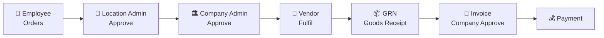
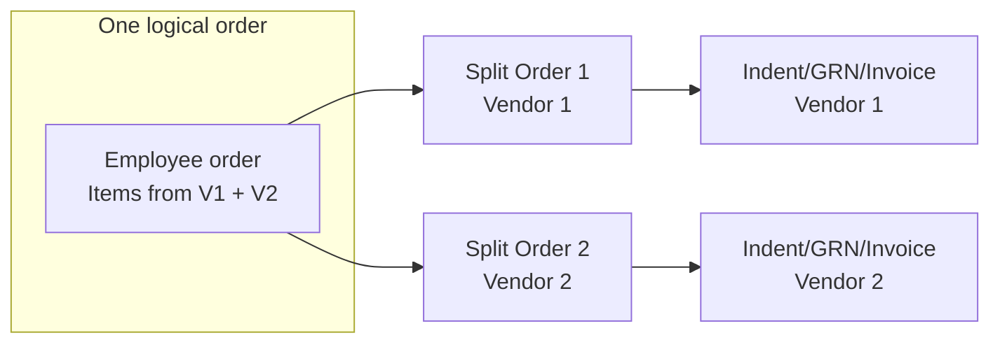
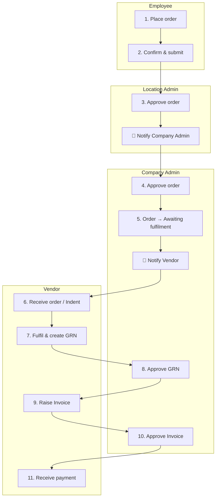

# UDS – Order to Invoice Flow (Multi-Company, Multi-Vendor)

High-level flow from **employee order** through **location admin → company admin → vendor → GRN → invoice**, including notifications.

---

## Simple diagram (readable anywhere)

You can understand this flow just by reading it. No special viewer needed.

```
  ┌─────────────────────────────────────────────────────────────────────────────────────────┐
  │  MULTIPLE COMPANIES (Company A, Company B, …)                                              │
  └─────────────────────────────────────────────────────────────────────────────────────────┘
                                              │
                                              ▼
  ┌──────────────┐     ┌──────────────┐     ┌──────────────────────────────────────────────┐
  │   EMPLOYEE    │     │   EMPLOYEE   │     │  1. Place order (catalog)                     │
  │   (any co.)   │────▶│   confirms   │────▶│  2. Confirm address & submit                  │
  └──────────────┘     └──────────────┘     └──────────────────────────────────────────────┘
                                                                              │
                                                                              ▼
  ┌─────────────────────────────────────────────────────────────────────────────────────────┐
  │  LOCATION ADMIN (Site Admin)                                                             │
  │  3. Sees order in “Approvals”  →  4. Approves or Rejects  →  📧 Notifies Company Admin   │
  └─────────────────────────────────────────────────────────────────────────────────────────┘
                                                                              │
                                                                              ▼
  ┌─────────────────────────────────────────────────────────────────────────────────────────┐
  │  COMPANY ADMIN                                                                           │
  │  5. Sees order in “Approvals”  →  6. Approves  →  Order = “Awaiting fulfilment”          │
  │  7. 📧 Notifies Vendor(s)                                                                 │
  └─────────────────────────────────────────────────────────────────────────────────────────┘
                                                                              │
                                                                              ▼
  ┌─────────────────────────────────────────────────────────────────────────────────────────┐
  │  MULTIPLE VENDORS (Vendor X, Vendor Y, …) – each gets their part of the order            │
  └─────────────────────────────────────────────────────────────────────────────────────────┘
                                              │
                                              ▼
  ┌─────────────────────────────────────────────────────────────────────────────────────────┐
  │  FULFILMENT                                                                              │
  │  8. Indent / suborders (per vendor)  →  9. Vendor ships items                            │
  │  10. Vendor creates GRN (Goods Receipt Note)  →  11. Company approves GRN  →  📧 Notify │
  └─────────────────────────────────────────────────────────────────────────────────────────┘
                                                                              │
                                                                              ▼
  ┌─────────────────────────────────────────────────────────────────────────────────────────┐
  │  INVOICE & PAYMENT                                                                       │
  │  12. Vendor raises Invoice  →  13. Company approves Invoice  →  📧 Notify             │
  │  14. Payment                                                                             │
  └─────────────────────────────────────────────────────────────────────────────────────────┘
```

**One-line summary:**  
Employee orders → Location Admin approves → Company Admin approves → Vendor fulfils & creates GRN → Company approves GRN → Vendor raises Invoice → Company approves Invoice → Payment.

---

## View as a picture (open in browser)

Open this file in a browser to see the diagram as a picture:  
**`docs/UDS_ORDER_FLOW_DIAGRAM.html`** (in the same folder). Double‑click it or drag it into Chrome/Edge/Firefox.

---

## Diagram (Mermaid)

```mermaid
flowchart TB
    subgraph COMPANIES["🏢 Multiple Companies"]
        C1[Company A]
        C2[Company B]
        C3[Company N...]
    end

    subgraph EMPLOYEE["👤 Employee"]
        E1[Place order<br/>Catalog + eligibility]
        E2[Confirm order<br/>Address, delivery]
    end

    subgraph LOCATION_ADMIN["📍 Location Admin (Site Admin)"]
        L1[Order appears in approvals]
        L2[Approve / Reject<br/>PR workflow]
        L3[📧 Notify Company Admin]
    end

    subgraph COMPANY_ADMIN["🏛️ Company Admin"]
        A1[Order appears in approvals]
        A2[Approve / Reject]
        A3[Order → Awaiting fulfilment]
        A4[📧 Notify Vendor(s)]
    end

    subgraph VENDORS["🚚 Multiple Vendors"]
        V1[Vendor X]
        V2[Vendor Y]
        V3[Vendor Z]
    end

    subgraph FULFILMENT["📦 Fulfilment"]
        F1[Indent / Suborders<br/>per vendor]
        F2[Vendor fulfils<br/>ships items]
        F3[GRN – Goods Receipt Note<br/>Vendor creates / uploads]
        F4[Company acknowledges/approves GRN]
        F5[📧 GRN approved notification]
    end

    subgraph INVOICE_PAYMENT["💰 Invoice & Payment"]
        I1[Vendor raises Invoice]
        I2[Company approves Invoice]
        I3[📧 Invoice approved notification]
        I4[Payment]
    end

    %% Flow
    COMPANIES --> EMPLOYEE
    E1 --> E2
    E2 --> L1
    L1 --> L2
    L2 --> L3
    L3 --> A1
    A1 --> A2
    A2 --> A3
    A3 --> A4
    A4 --> VENDORS
    VENDORS --> F1
    F1 --> F2
    F2 --> F3
    F3 --> F4
    F4 --> F5
    F5 --> I1
    I1 --> I2
    I2 --> I3
    I3 --> I4
```

---

## Simplified Linear Flow (One path)



---

## Notifications (Where they fire)

| Step | Who is notified | When |
|------|------------------|------|
| Order created (with location) | Location Admin(s) | Order needs site approval |
| Site Admin approves | Company Admin(s) | Order needs company approval |
| Company Admin approves | Vendor(s) | New order to fulfil |
| GRN submitted | Company Admin | GRN to acknowledge/approve |
| GRN approved | Vendor / relevant parties | GRN approved (workflow event) |
| Invoice submitted | Company Admin | Invoice to approve |
| Invoice approved | Vendor / finance | Invoice approved (workflow event) |

---

## Multi-Company, Multi-Vendor (Split orders)

- **Multiple companies**: Each company has its own employees, location admins, company admins, and orders. Data is scoped by `companyId`.
- **Multiple vendors**: One order can have items from **Vendor X** and **Vendor Y**. The system creates **split orders** (one per vendor). Each vendor sees only their part; location/company approval applies to the full order; fulfilment (indent, GRN, invoice) is per vendor.



---

## Status progression (order)

1. **Order created** → `PENDING_SITE_ADMIN_APPROVAL` (if location workflow) or `PENDING_COMPANY_ADMIN_APPROVAL`
2. **Location Admin approves** → `PENDING_COMPANY_ADMIN_APPROVAL` + 📧 Company Admin
3. **Company Admin approves** → `Awaiting fulfilment` + 📧 Vendor
4. **Vendor fulfils** → Indent / suborders → GRN
5. **GRN approved** → 📧 GRN approved
6. **Vendor invoice** → Company approves → 📧 Invoice approved → Payment

---

---

## Swimlane view (by role)



---

*Diagram source: `docs/UDS_ORDER_FLOW_DIAGRAM.md`. Render in GitHub, VS Code (Mermaid), or any Mermaid-supported viewer.*
